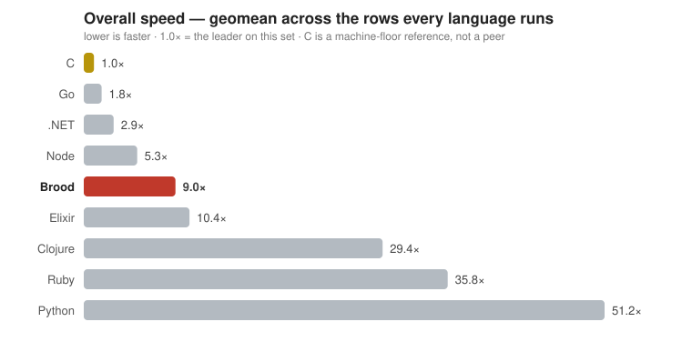

# benchmark — Brood vs C vs Clojure vs Elixir vs Python vs Node vs Ruby vs .NET

**31 programs under one harness**, measuring where the Brood runtime stands on startup,
memory, compute and concurrency. Brood is a young runtime measured against mature ones:
a "where does it stand today" snapshot, not a claim to lead. **C is a machine-floor
reference** — 16 compute rows, not a peer ([why not all 31](bench/c/README.md)).



Geometric mean over the 15 rows every column runs, so each benchmark counts once whatever its
absolute size. **Not comparable with runs before 2026-08-14:** adding C narrowed that set from 27
rows to 15 and moved the reference from .NET to C, so the multiples grew without anything getting
slower — the denominator moved. Memory per language is in the standings table below.

### Brood over time


Per-row, each against its own first published run — immune to the rebase above, which is why this
is the chart to read for progress rather than the scalar. Across every published run at this size:
`spawn-live` **−70%** (5362 → 1616 ms), `fib` **−83%**, `bintree` **−66%**, `ring` **−58%**. Rows
are only compared across runs at the same `N`.

<!-- BEGIN STANDINGS (generated by bench/docs.py) -->
**2026-08-28 run.** Numbers regenerate with each run; the full table is in [BENCHMARKS.md](BENCHMARKS.md).

| | Brood | field |
|---|---|---|
| startup (wall) | 22.2 ms | C 1.9, Python 10.1, Node 18.0, .NET 21.5, Ruby 38.6, Elixir 183.4, Clojure 340.3 ms |
| base RSS | 72.0 MB | C 1.5, Python 9.6, Ruby 19.0, .NET 25.9, Node 42.7, Elixir 71.7, Clojure 103.9 MB |
| overall speed — geomean of the 15 rows every column implements | 10.4× the fastest (5/8) | C 1.0 · .NET 3.1 · Node 5.2 · Elixir 10.4 · Clojure 31.0 · Ruby 36.2 · Python 51.7 |
| aggregate single-threaded compute | 6.0× the fastest | C 1.0 · .NET 2.0 · Node 4.4 · Elixir 7.3 · Clojure 15.2 · Ruby 25.6 · Python 53.5 |
| aggregate vs the field's average | **0.80×** | ahead of the field average on 7 of 11 core-compute rows |
| rank by row | 1st on —; last on `spawn-live` | |
| `spawn-live` (300k units held alive, each sent a copied message) | 1.42 s, 1.63 GB, 3.72 CPU·s | Elixir 709 ms / 922 MB — the only peer; Node 219 ms / 243 MB, .NET 276 ms / 139 MB, Python 1.27 s / 361 MB are coroutines on a shared heap |
| `supervisor` (20k supervised children, a quarter retired and restarted) | 879 ms, 619 MB | Elixir 266 ms / 157 MB — the only peer; no other runtime here has a supervisor |
| `latency` p99 / p99.9 (20k req/s, 5% of them occupying 500µs) | **87 µs / 816 µs** | Elixir 64 / 82 µs · Node 454 / 517 µs · Python 459 / 604 µs · .NET 779 / 13185 µs — the compute winner has the worst tail |
<!-- END STANDINGS -->

## Read more

- **[BENCHMARKS.md](BENCHMARKS.md)** — every benchmark × language, the per-row tables,
  methodology and the fairness rules.
- **[FRONTIER.md](FRONTIER.md)** — where Brood's gaps are and what would move them.
- **[bench/c/README.md](bench/c/README.md)** — what the C column does and does not measure.
- **[results/report.md](results/report.md)** / **[results.json](results/results.json)** — the latest
  run's raw output, with every benchmark and what it stresses.

## Running it

```sh
python3 bench/harness.py                        # full suite, best of 3 → results/
python3 bench/harness.py --only fib --langs brood,c   # a subset
python3 bench/chart.py && python3 bench/trend.py && python3 bench/docs.py   # charts + docs
```

Sources live in [`bench/`](bench/), one file per benchmark per language, named identically
except the extension (`fib.blsp` / `fib.c` / `fib.clj` / `fib.ex` / …) so they diff side by
side. Sizes come from `BENCH_N`, so any program also runs standalone:
`BENCH_N=35 brood bench/brood/fib.blsp`.

Every program prints one integer and the harness **fails the run if the columns disagree**, so
the work is provably equivalent; generated data uses one identical LCG
(`x = (x*1103515245 + 12345) & 0x7fffffff`, seed `123456789` — Node needs `BigInt` to stay
bit-identical past 2^53). Rankings use **compute = wall − that language's own `startup` time**,
so a slow-booting runtime's real speed is visible.

## Environment

<!-- BEGIN ENVIRONMENT (generated by bench/docs.py) -->
Numbers in the docs were measured on `whklat`: a 12-core x86-64 Linux 7.0.0 machine · Brood 0.22.0 (`60a2f6ec`) (bytecode VM + tier-1 JIT) · Clojure 1.12.5 / OpenJDK 25.0.4 (HotSpot) · Elixir 1.21.0-dev (b82c44a) / OTP 28 (BeamAsm JIT) · Python 3.14.4 · Node 22.21.0 (V8) · ruby 3.3.8 · .NET 10.0.111 (RyuJIT). 2026-08-28.
<!-- END ENVIRONMENT -->

## License

Licensed under the GNU Affero General Public License v3.0 (`AGPL-3.0-only`); see
[`LICENSE`](LICENSE). Copyright © 2026 Wilhelm Kirschbaum.
