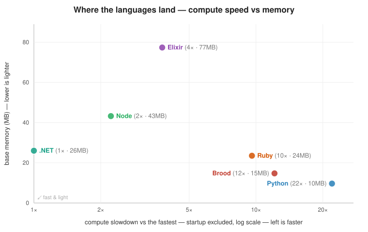

# benchmark — Brood vs Elixir vs Python vs Node vs Ruby vs .NET

A cross-language micro-benchmark suite: **15 small programs, each implemented
six times** (once per language) and run under one identical harness, to see
where the Brood runtime is faster or slower than the alternatives — on
**startup**, **memory**, **raw performance**, and **concurrency**. The field spans
interpreters (Python, Ruby) and JITs (Node/V8, Elixir/BeamAsm, .NET/RyuJIT).

> **Engine:** Brood runs on its **bytecode VM** — the closure-compiling engine
> that superseded the original tree-walker — with **primitive inlining** (core
> arithmetic/comparison ops run inline as native `i64` operations) and a **tier-1
> template JIT**. With **back-edge tiering** the JIT fires on self-tail integer
> loops (a tight `loop` runs native, **5.4×**; a bare 200M-iter loop 8 s → 0.55 s),
> and **native-to-native call linking** now puts non-tail recursion on the native
> path too — a JIT'd caller invokes a JIT'd callee directly instead of round-tripping
> through the VM (**fib 1.6×, pfib 1.8×, bintree 1.2×**). `VectorRef` codegen handles
> matmul's indexed loop (**153 → 102 ms**) and fixing two codegen bails did the same
> for `collatz` (**289 → 63 ms**).
> A **process-count-aware GC floor** keeps parallel fan-out's peak memory low
> (`pfib` peaks ~15 MB). Earlier **data-structure fast paths** moved more rows:
> inlining `nth`/`vector-ref` to a slab read, a primitive-reducer fold
> (**reduce ~4.7×**), a single-pass native `join` (**strings ~2.2×**), and
> fixed-arity `get`/`assoc` (**wordcount ~1.3×**) — all checksum-verified.

## Results

- **[BENCHMARKS.md](BENCHMARKS.md)** — the full breakdown: total wall time, peak
  memory, and the verdict on where Brood wins and loses.
- **[results/report.md](results/report.md)** / **[results/results.json](results/results.json)**
  — the most recent run's tables and raw numbers (regenerated by the harness).



**The short version:** Brood's strengths are **memory** (~14 MB base, holding
14–38 MB across *every* workload — only Python is as light) and **fast-enough
startup** (~27 ms, ahead of Ruby and ~9× ahead of the BEAM). On **concurrent I/O**
(`http`) it lands a respectable 3rd of six (~1.4× behind Node, just behind .NET),
and on **parallel CPU** (`pfib`) it holds the **lightest memory in the field**
(~15 MB). Its main weakness is **raw single-threaded compute** — the young bytecode
VM trails the JITs (.NET and Node lead) and the interpreters (Ruby, Python). Recent
work closed several gaps: the JIT now compiles self-tail loops (`loop` 5.4×,
`collatz`), matmul's indexed loop, and — via native-to-native call linking —
**non-tail recursion** (`fib` 1.6×, `pfib` 1.8×, `bintree` 1.2×), and
data-structure fast paths fixed `reduce`, `strings`, and `wordcount`. The
remaining frontier is **float** support for `mandelbrot` (the integer-only JIT
can't yet tier it) and **allocation** (`bintree`'s short-lived nodes). See
[BENCHMARKS.md](BENCHMARKS.md)
for the honest, full picture, a [positioning chart](results/positioning.svg), and
the code side by side.

## The benchmarks (15)

| name | stresses |
|------|----------|
| `startup`    | interpreter/VM startup + base memory |
| `fib`        | naive recursion / function-call overhead (`fib(30)`) |
| `loop`       | raw iteration — tail recursion vs a `for` loop |
| `reduce`     | higher-order fold over a materialised range |
| `primes`     | integer arithmetic — count primes by trial division |
| `collatz`    | integer arithmetic in a tight inner loop |
| `mandelbrot` | floating-point math — escape iterations over a grid |
| `matmul`     | nested loops + indexing — integer N×N multiply |
| `strings`    | string building (`join`) + length |
| `wordcount`  | hash-map build — **immutable** (Brood/Elixir) vs **mutable** (Python/Node/Ruby/.NET) |
| `bintree`    | allocation / GC pressure — build & walk many binary trees |
| `sort`       | sort a list of ints + an order-sensitive checksum walk |
| `spawn`      | lightweight concurrent units + result collection |
| `pfib`       | parallel CPU — 100 `fib`s computed at once across cores |
| `http`       | concurrent I/O — 500 in-flight HTTP GETs to a local server |

`spawn`, `pfib`, and `http` are each implemented in all six languages, using that
language's idiomatic concurrency. For `spawn` (20k lightweight units): green
processes + messaging for Brood/Elixir; asyncio coroutines (Python), Promises
(Node), OS threads (Ruby), thread-pool tasks (.NET). For the CPU-bound `pfib`:
green processes (Brood/Elixir), `worker_threads` (Node), `Parallel.For` (.NET), a
forked process pool (Python/Ruby). For the I/O-bound `http`: green processes
(Brood/Elixir), an async client (Node/.NET), a thread pool / thread-per-request
(Python/Ruby). Green processes / actors are a first-class Brood & BEAM feature, so
`spawn` is where that model is exercised head-to-head against threads and event
loops — the comparison is deliberate, not like-for-like machinery.

## What's measured

For every (benchmark × language) pair the harness records:

- **Wall time** — total process time, *including* interpreter/VM startup. Best
  of N runs (least-noisy). Measured with `time.perf_counter()` around the child.
- **Peak RSS** — maximum resident memory, from `/usr/bin/time -v`.
- **Checksum** — each program prints one integer. The harness asserts all six
  languages produce the **same** checksum, so we know they did equivalent work.
- **`compute`** (in `results/report.md`) — wall − that language's own `startup`,
  so a slow-booting runtime's real compute speed is visible (e.g. the BEAM, whose
  warm compute beats Ruby/Python even though its boot buries it in the wall time).

Because wall time includes startup, the dedicated `startup` benchmark (a bare
"print 0") isolates the fixed cost; compute time for the others is roughly
`wall − startup`.

## Fairness notes

- **Same algorithm, same inputs, same output.** Where data is generated
  (`sort`, `wordcount`) every language runs the *identical* LCG
  (`x = (x*1103515245 + 12345) & 0x7fffffff`, seed `123456789`), so all six
  sort/tally the same stream. Checksums confirm it.
  - In **Node** that multiply exceeds the `2^53` safe-integer range, so the LCG
    uses `BigInt` to stay bit-identical to the others. (Python and Ruby have
    arbitrary-precision integers natively; **.NET** uses `long` — the product
    fits in 64 bits — so neither needs special handling.)
- **Idiomatic, not adversarial.** Each version is written the way you'd
  naturally write it in that language: tail recursion + immutable maps in
  Brood/Elixir, `for` loops + mutable dicts/hashes in Python/Node/Ruby/.NET.
  That's the point — we're comparing the languages as used, not forcing one style.
- Float results (`mandelbrot`) rely on IEEE-754 `f64` behaving identically
  across all six runtimes — confirmed by matching checksums.
- Workload sizes are picked so the *slowest* runtime (the Brood bytecode VM)
  finishes in a few seconds; the compiled/JIT runtimes finish in milliseconds.
  That spread is the result, not a problem.
- The `http` benchmark hits a small local server the harness starts on a free
  loopback port (a fixed 20 ms sleep per request, so it measures I/O-concurrency,
  not the network); the harness verifies the server is its own — a GET returning
  `200`/`ok` — before running, then tears it down afterwards.

## Running it

```sh
python3 bench/harness.py                      # full suite, best of 3 → results/
python3 bench/harness.py --quick              # smaller sizes, smoke test
python3 bench/harness.py --runs 5
python3 bench/harness.py --only fib,sort      # subset of benchmarks
python3 bench/harness.py --langs brood,python # subset of languages
python3 bench/chart.py                         # regenerate results/positioning.svg
```

The source programs live under [`bench/`](bench/), six per benchmark, named
identically except the extension
(`fib.blsp` / `fib.exs` / `fib.py` / `fib.js` / `fib.rb` / `fib.cs`) so the
implementations diff side by side. **.NET** needs compilation, so the harness
builds `bench/dotnet/` once (`dotnet build -c Release`) and runs each benchmark as
a native binary — the fair analog of running the others via their runtime.
Workload sizes are read from `BENCH_N` (the harness sets it); each program has a
sensible default baked in, so you can also run one directly:

```sh
BENCH_N=35 brood bench/brood/fib.blsp
BENCH_N=35 node  bench/node/fib.js
```

Output lands in `results/`: `results.json` (raw numbers), `report.md` (formatted
tables — wall, the startup-excluded `compute` column, slowdown vs the fastest,
peak RSS, checksum), and `positioning.svg` (the compute-vs-memory map).

## Environment

Numbers in the docs were measured on `whklat`: a 12-core x86-64 Linux 7.0.0
machine · Brood 0.1.0 (bytecode VM + tier-1 JIT, primitive inlining,
process-count-aware GC floor) · Elixir 1.20.0 / OTP 28 (BeamAsm JIT) · Python
3.14.4 · Node 22.21.0 (V8) · Ruby 3.3.8 · .NET 10.0.108 (RyuJIT). Best of 3 runs
each; the concurrency benchmarks (`spawn`/`pfib`/`http`) take the best of 7.
