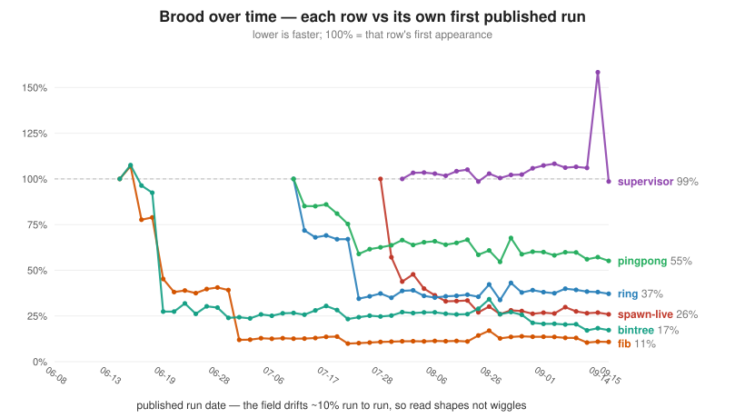

# benchmark — Brood vs Clojure vs Elixir vs Python vs Node vs Ruby vs .NET

**29 small programs** under one harness, measuring where the Brood runtime stands on startup,
memory, compute and concurrency. 28 are implemented once per language; `spawn-live` needs a real
process, which only Brood and Elixir provide. The field spans interpreters (Python, Ruby), JITs
(Node/V8, Elixir/BeamAsm, .NET/RyuJIT) and a fellow immutable-data Lisp (Clojure/HotSpot).

Brood is a young runtime measured against mature ones: this is a "where does it stand today"
snapshot, not a claim to lead.

## Results

- **[BENCHMARKS.md](BENCHMARKS.md)** — the data: every benchmark, every language, in one table.
- **[results/report.md](results/report.md)** / **[results/results.json](results/results.json)**
  — the most recent run's full tables and raw numbers (regenerated by the harness).
- **[FRONTIER.md](FRONTIER.md)** — for contributors: where the gaps are and what would move them.


The map aggregates **all 27 rows every port implements**, as a geometric mean of per-row ratios
so each benchmark counts once regardless of its absolute size, normalised so the leading runtime
reads 1×. It used to plot eleven single-threaded rows summed by wall time, which left two thirds
of the suite out of the picture *and* let whichever row was largest in milliseconds decide
everyone's position.

Brood reads **2.3×** the leader over the wider set against 2.8× over the eleven compute rows —
so the broader picture is not the harsher one for Brood in absolute terms. It does drop from 3rd
to **4th**, because Elixir gains more than Brood does when the concurrency rows are counted.

Worth knowing how to read a per-row geomean: a language scores 1× only by being fastest on
*every* row, which nothing is — .NET leads and still wins just 13 of 27. So these are ratios to
the leader, not to some perfect runtime.

The three rows not in it are the ones no cross-field scalar can hold: `spawn-live` and `latency`
have five ports each, `supervisor` two, so aggregating them would compare different work. They
are in the standings table below and in [BENCHMARKS.md](BENCHMARKS.md). Note also what a
27-row geometric mean *cannot* show: a large win on a single row barely moves it, by design —
including `spawn-live` at all would shift Brood only 4.76 → 4.84×. Read the per-row tables for
per-row progress.

### Brood over time



The map above answers "where does this runtime stand"; this one answers "did the thing we
optimised move", which a field-wide scalar cannot. `spawn-live` is **−67%** across seven
published runs (5362 → 1771 ms) — progress entirely invisible on the positioning map, because
one row inside a 27-row geometric mean barely shifts it. Regenerate with
`python3 bench/trend.py`; the data is every published `results.json` in git history, so it is
a record of what was published rather than a re-measurement. Rows are compared only across
runs at the same `N` (`fib` went 30 → 35 and `bintree` 40 → 200 early on, which reads as a
285% blow-up if you normalise straight through it).

<!-- BEGIN STANDINGS (generated by bench/docs.py) -->
**2026-08-10 run.** Numbers regenerate with each run; the full table is in [BENCHMARKS.md](BENCHMARKS.md).

| | Brood | field |
|---|---|---|
| startup (wall) | 16.1 ms | Python 10.3, Node 18.0, .NET 21.7, Ruby 38.9, Elixir 185.8, Clojure 339.1 ms |
| base RSS | 23.2 MB | Python 9.7, Ruby 19.0, .NET 25.8, Node 42.3, Elixir 72.4, Clojure 103.0 MB |
| overall speed — geomean of all 27 rows every port implements | 2.3× the fastest (4/7) | .NET 1.0 · Node 1.3 · Elixir 1.4 · Ruby 4.9 · Python 6.4 · Clojure 9.4 |
| aggregate single-threaded compute | 2.8× the fastest | .NET 1.0 · Node 2.7 · Elixir 3.4 · Clojure 8.4 · Ruby 12.2 · Python 28.8 |
| aggregate vs the field's average | **0.52×** | ahead of the field average on 6 of 11 core-compute rows |
| rank by row | 1st on `reduce`, `strings`; last on `spawn-live` | |
| `spawn-live` (300k units held alive, each sent a copied message) | 1.75 s, 1.60 GB, 4.66 CPU·s | Elixir 708 ms / 916 MB — the only peer; Node 227 ms / 247 MB, .NET 288 ms / 138 MB, Python 1.30 s / 361 MB are coroutines on a shared heap |
| `supervisor` (20k supervised children, a quarter retired and restarted) | 847 ms, 464 MB | Elixir 254 ms / 153 MB — the only peer; no other runtime here has a supervisor |
| `latency` p99 / p99.9 (20k req/s, 5% of them occupying 500µs) | **73 µs / 492 µs** | Elixir 58 / 90 µs · Python 467 / 711 µs · Node 472 / 574 µs · .NET 839 / 13211 µs — the compute winner has the worst tail |
<!-- END STANDINGS -->

The aggregate covers the core-compute rows only and varies ±0.3 run-to-run.

**`spawn-live` is Brood's worst row**: 300k units held alive, each handed a message it must
*copy*. Against its only peer Brood is 2.5× slower and 1.8× heavier (~5.5 KB per live process
against Elixir's ~3.1 KB). It improved again this run — **−16% CPU·s**, the fourth consecutive
move — from folding the payload in a native counted loop instead of a Brood-level one, and from
testing a vector *first* in `fold`'s type dispatch instead of last. The reducer is the ordinary
`+`, which is a thin wrapper over the primitive, and its redirect had been re-resolved on every
element; the range path already resolved it once, and the vector path simply never consulted that.

What remains is the **process floor** — the largest single piece, and unchanged by any of this —
plus the cost of *reaching* the fold at all: a cold call into the Brood-level `fold` wrapper is
now larger than the fold it performs. The **receive machinery** was the standing suspect here and
has been measured and dropped: a matcher whose pattern compares a literal really does miss the
JIT's native fast frame, but making it native is worth ~2% of this row, inside the run-to-run
noise. See [FRONTIER.md](FRONTIER.md).

Read `cores`/`CPU·s` alongside wall time: Node and Python units are coroutines on one event loop,
cheap because they provide less.

**Caveat on Clojure:** the JVM cold-starts (~0.35 s) each single-shot run and HotSpot never fully
JITs the hot loops in that window, so a long-running service would be far faster. Brood, Python,
Node, Ruby and Clojure run from source; only Elixir and .NET are precompiled.

## The benchmarks (29)

| name | stresses |
|------|----------|
| `startup`    | interpreter/VM startup + base memory |
| `fib`        | naive recursion / function-call overhead (`fib(35)`) |
| `loop`       | raw iteration — tail recursion vs a `for` loop |
| `reduce`     | higher-order fold over a materialised range |
| `primes`     | integer arithmetic — count primes by trial division |
| `collatz`    | integer arithmetic in a tight inner loop |
| `mandelbrot` | floating-point math — escape iterations over a grid |
| `matmul`     | nested loops + indexing — integer N×N multiply |
| `strings`    | string building — comma-join 0..n-1 + length (Brood/Elixir join the range directly) |
| `wordcount`  | hash-map build — **immutable** persistent maps (Brood/Elixir/Clojure) vs **mutable** dicts/hashes (Python/Node/Ruby/.NET) |
| `bintree`    | allocation / GC pressure — build & walk many binary trees |
| `sort`       | sort a list of ints + an order-sensitive checksum walk |
| `nqueens`    | backtracking recursion — count N-queens solutions (`N=10`) |
| `errors`      | error handling — raise + recover a value-carrying exception N times |
| `errors-deep` | error propagation — throw 50 frames deep, catch at the top |
| `pipeline`   | a `filter → map → reduce` composition over a range, written in each language's lazy/streaming style (Elixir `Stream`, Python generators, .NET LINQ) |
| `ackermann`  | deep non-tail double-recursion — `ack(3,9)` (depth ~4093) summed N times |
| `sieve`      | Sieve of Eratosthenes — a mutable bool array (native) vs a `Table` (Brood has no mutable array) |
| `persistent-map` | read-modify-write churn over a 50k-key space — deep CHAMP (Brood/Clojure/Elixir) vs mutable hash |
| `nbody`      | floating-point physics sim (5-body, N steps) — energy is **bit-identical** across all seven |
| `json`       | JSON encode+parse round-trip — pure-Brood `std/json` vs native parsers |
| `regex`      | regex full-match counting — pure-Brood `std/regex` vs native engines |
| `base64`     | base64 encode+decode — pure-Brood `std/encoding` vs native codecs |
| `spawn`      | lightweight concurrent units + result collection |
| `spawn-live` | hold **300,000 units alive at once**, then wake each with a message it must **copy**. Five languages run it, but their units differ in kind: Brood/Elixir processes are isolated + preemptively scheduled; Node/Python/.NET units are coroutines on a shared heap. Read the `cores` and `CPU·s` columns alongside wall time (see the note in `bench/brood/spawn-live.blsp`) |
| `pfib`       | parallel CPU — 100 `fib(31)`s computed at once across cores |
| `http`       | concurrent I/O — N in-flight HTTP GETs to a local server |
| `pingpong`   | message round-trip **latency** — two units bounce a token N times |
| `ring`       | N-process **ring** — a token travels N×5000 hops around the ring |

`spawn-live` is the exception to everything below: the units are not equivalent across
languages (only Brood and Elixir provide isolation + preemption), so it is excluded from the
field-wide aggregate and reported on its own — see
[BENCHMARKS.md](BENCHMARKS.md#spawn-live--300000-units-held-alive-each-sent-a-copied-message).

The five idiomatic concurrency rows (`spawn`, `pfib`, `http`, `pingpong`, `ring`) each use that
language's own machinery — green processes for Brood/Elixir, Promises/`worker_threads` for Node,
asyncio/pools for Python/Ruby, `future`s for Clojure, tasks/channels for .NET. `pingpong`/`ring`
isolate message-passing latency, where the BEAM's tuned mailbox shows: Elixir leads both.

## What's measured

For every (benchmark × language) pair the harness records **wall time** (total
process time including startup, best of N runs), **peak RSS** (`/usr/bin/time -v`,
worst of the same N runs), and a **checksum** — each program prints one integer, and
the harness fails the run if the seven languages disagree, so the work is
provably equivalent. Rankings use **compute** = wall − that language's own
`startup`-row time (a bare "print 0"), so a slow-booting runtime's real speed
is visible — e.g. the BEAM's warm compute beats Ruby/Python even though its
boot buries it in wall time.

Wall is a best-of but RSS a worst-of, so every language gets one **discarded warmup run** first —
otherwise a one-time cold-cache cost lands in the memory column alone (`--no-warmup` opts out).

## Fairness notes

- **Same algorithm, inputs and output.** Generated data uses one identical LCG
  (`x = (x*1103515245 + 12345) & 0x7fffffff`, seed `123456789`; Node needs `BigInt` to stay
  bit-identical past `2^53`), and the checksum gate confirms it.
- **Idiomatic, not adversarial** — tail recursion + immutable maps in Brood/Elixir, `for` loops +
  mutable dicts elsewhere. Where idioms differ (`primes`' bound: most hoist a `sqrt`,
  Brood/Clojure test `(* d d) > m`) the asymmetry counts against Brood.
- **Sizes** are picked so even the fastest runtime spends ≥ ~100 ms of compute, and keep every
  checksum in exact-integer range — scaling `BENCH_N` far past the defaults can push Node past
  `2^53`, which the checksum gate catches.
- `http` hits a local server the harness starts on a free loopback port (20 ms sleep per request,
  so it measures I/O-concurrency, not the network).

## Running it

```sh
python3 bench/harness.py                      # full suite, best of 3 → results/
python3 bench/harness.py --quick              # smaller sizes, smoke test
python3 bench/harness.py --runs 5
python3 bench/harness.py --only fib,sort      # subset of benchmarks
python3 bench/harness.py --langs brood,python # subset of languages
python3 bench/chart.py                         # regenerate results/positioning.svg
```

The source programs live under [`bench/`](bench/), seven per benchmark, named
identically except the extension
(`fib.blsp` / `fib.clj` / `fib.ex` / `fib.py` / `fib.js` / `fib.rb` / `fib.cs`)
so the implementations diff side by side. **.NET** needs compilation, so the harness
builds `bench/dotnet/` once (`dotnet build -c Release`) and runs each benchmark as
a native binary — the fair analog of running the others via their runtime.
Workload sizes are read from `BENCH_N` (the harness sets it); each program has a
sensible default baked in, so you can also run one directly:

```sh
BENCH_N=35 brood bench/brood/fib.blsp
BENCH_N=35 node  bench/node/fib.js
```

Output lands in `results/`: `results.json` (raw numbers), `report.md` (formatted
tables — wall, the startup-excluded `compute` column, slowdown vs the fastest,
peak RSS, checksum), and `positioning.svg` (the overall-speed-vs-memory map).

## Environment

<!-- BEGIN ENVIRONMENT (generated by bench/docs.py) -->
Numbers in the docs were measured on `whklat`: a 12-core x86-64 Linux 7.0.0 machine · Brood 0.3.9 (`853afe6f`) (bytecode VM + tier-1 JIT) · Clojure 1.12.5 / OpenJDK 25.0.3 (HotSpot) · Elixir 1.21.0-dev (b82c44a) / OTP 28 (BeamAsm JIT) · Python 3.14.4 · Node 22.21.0 (V8) · ruby 3.3.8 · .NET 10.0.110 (RyuJIT). 2026-08-10.
<!-- END ENVIRONMENT -->
each, after one discarded warmup run per language; the concurrency benchmarks
(`spawn`/`pfib`/`http`/`pingpong`/`ring`) take
the best of 7, and **`startup` the best of 9** — it is subtracted from every other
row, so an over-estimate of it silently deflates the whole field. At best-of-3 it
did: a high Elixir boot sample (197 ms against a true ~182 ms) drove six of its
short rows to a clamped `0.0 ms`, handing it spurious 1st places. The harness now
samples `startup` hardest by default and **fails any run** in which a language's
wall lands at or below its own startup, since that is a corrupted measurement
rather than a fast one. Each run is CPU-pinned with `taskset` (compute benchmarks to 4 dedicated
cores, the concurrency ones to all 12) with a 0.25 s settle between runs. The compute
workload is single-threaded; the 4-core pin isolates it from system noise **without**
serialising a runtime's background JIT/GC threads onto the work core — a single-core
pin penalised the JVM ~2×. Precompilation and the Clojure cold-start caveat are
covered above.

## License

Licensed under the GNU Affero General Public License v3.0 (`AGPL-3.0-only`); see
[`LICENSE`](LICENSE). Copyright © 2026 Wilhelm Kirschbaum.
